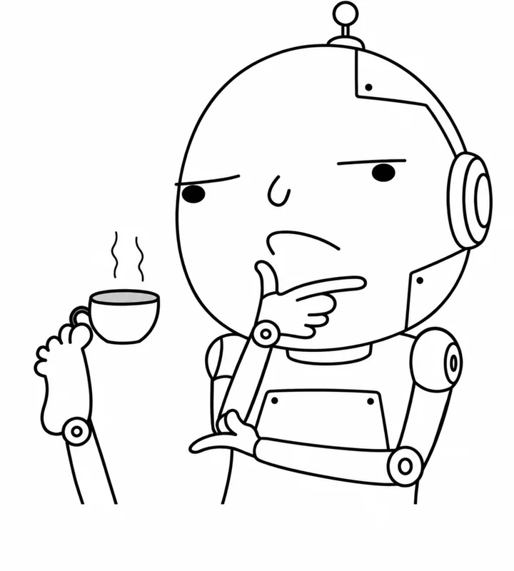

<p align="center">
  
</p>

<h1 align="center">Pi Agent Ask</h1>

<p align="center"><strong>Give your agent permission to ask “What the fuck?”</strong></p>

<p align="center">
  <a href="https://www.npmjs.com/package/pi-agent-ask"></a>
  <a href="https://github.com/alexshpunt/pi-agent-ask/actions/workflows/ci.yml"></a>
  <a href="./LICENSE"></a>
  <a href="https://github.com/alexshpunt/pi-agent-ask/discussions"></a>
</p>

You gave your agent an obscure task. It didn't understand a damn thing.

Instead of blindly following your bullshit, it asks a question.

**And it keeps working while you answer.**

## Install

Install [Pi](https://pi.dev/), then:

```bash
pi install npm:pi-agent-ask
```

Or install directly from GitHub:

```bash
pi install git:github.com/alexshpunt/pi-agent-ask
```

Remove any other pi-ask installation so only one extension provides `ask_user`, then reload Pi.

## Ask. Keep working. Get the answer.

The agent calls `ask_user`. You get a form with choices, previews, your own answer, and notes. Not another wall of text to untangle.

With `background: true`, the agent continues independent work. Your answer arrives between turns, or wakes an idle agent. If there's nothing else it can do, it calls `wait_for_answers`.

It still has to wait before doing work that depends on your answer. “Keep working” doesn't mean “guess anyway.”

The bundled [skill](skills/ask-user/SKILL.md) guides the agent to ask when a decision matters. It doesn't force every agent to behave.

## Your answers aren't disposable

The agent can look up earlier questions and answers, then export them as a Markdown artifact for your task:

- `list_ask_history` finds past questions.
- `read_ask_history` reads the question, choices, answer, and notes.
- `export_ask_history` exports all or selected records.

The journal survives **compaction, reload, and resume**. It follows the current session branch, not every conversation you've ever had. Unfinished forms can recover too.

## The boring bits

Use `/ask-settings`, or press `?` in a form. See [configuration](docs/configuration.md), [tool behavior](docs/contract.md), and [integration events](docs/remote-events.md).

This fork of [eko24ive/pi-ask](https://github.com/eko24ive/pi-ask) adds background questions, waiting, durable history/export, external UI support, and Herdr status. It drops chat question extraction and manual answer/replay commands. The agent asks directly; the form needs no extra model call.

Herdr support includes [maudelv's work](https://github.com/maudelv/pi-ask/tree/feat/herdr-blocked-state); the skill was inspired by [edlsh/pi-ask-user](https://github.com/edlsh/pi-ask-user).

Found a weird case? [Open an issue](https://github.com/alexshpunt/pi-agent-ask/issues). Got an idea? [Start a discussion](https://github.com/alexshpunt/pi-agent-ask/discussions). [Contributions](CONTRIBUTING.md) welcome. [MIT](LICENSE).
